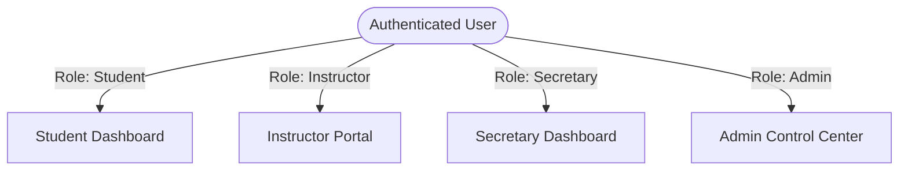
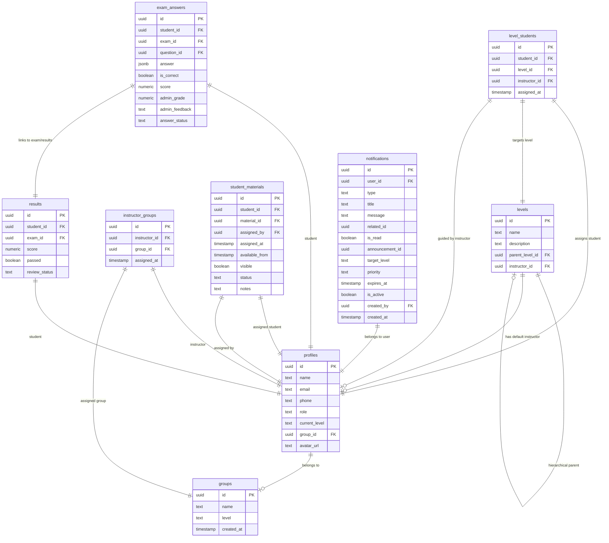
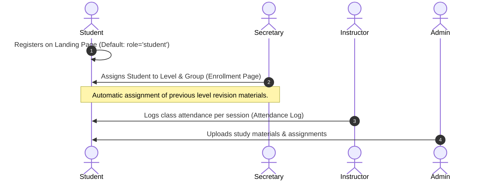

# 🇩🇪 Leidenschaft Klub LMS Platform

Leidenschaft Klub is a premium German language institute Learning Management System (LMS) designed to support offline classroom teaching with a powerful, secure, and real-time online platform.

> 🎯 **Tagline:** From passion to professionalism  
> 🇩🇪 **Goal:** Enhance offline German education with a state-of-the-art digital ecosystem.

---

## 🎨 Brand Identity & Aesthetics

- **Primary Colors:**
  - `Black` (`#000000` / `#1A1A1A`) - Modern, sleek base
  - `Red` (`#E53935` / `#DE0002`) - Passion, cultural energy
  - `Beige/Orange` (`#F5E1C8` / `#D4A373` / `#F97316`) - Warmth, approachability, premium accents
- **Typography:** Sleek, high-contrast, modern sans-serif.
- **Design Language:** Modern minimalism, glassmorphism, responsive sidebar layout, smooth Framer Motion micro-animations, loading skeletons, and interactive state triggers.

---

## 🔐 Role-Based Access Control (RBAC)

The platform is built on a secure, multi-tenant architectural design where access is governed by four distinct roles. Each role maps to a tailored workspace with specific access permissions and features.



### 1. 👨‍🎓 Student Dashboard
Designed for an interactive learning experience with full support for course resources, assignment submissions, and secure exam taking.
- **Welcome & Level Tracking:** View current level, level-based progress bars, and stats overview.
- **My Courses & Lessons:** Access assigned lessons, download PDFs, and watch videos.
- **Student Materials System:** View materials specifically assigned to them by the admin/secretary. Features two material statuses:
  - `assigned` (for current level lessons)
  - `revision` (access to previous levels' materials for study)
- **Assignments:** View deadlines, download attachments, and submit text, file uploads, or **audio answer recordings** directly through the UI.
- **Exam Center:** Take active exams with:
  - **Dynamic Timer:** Secure time-limit enforcement.
  - **Auto-gradable MCQ Questions:** Instantly calculated on final submission.
  - **Advanced Question Types:** Supports text, paragraph, grammar, writing, and **listening exams** (embedded audio files).
  - **Autosave System:** Answers are dynamically saved to the cloud per question (`upsert_student_exam_answer`) to prevent progress loss from unexpected disconnects.
- **Profile & Progress:** Update personal info (name, email, phone, avatar_url). View detailed attendance charts, passing percentages, and historical metrics.
- **Notifications & Events:** Receive real-time notifications (materials, exams, results, announcements) and book tickets for upcoming cultural/learning events.

### 2. 👨‍🏫 Instructor Portal
Empowers educators to manage the groups they teach and grade student performance.
- **Group Directory:** View all assigned groups (via `instructor_groups` mapping table) and corresponding levels.
- **Roster & Profiles:** Access student profiles, contact details, and attendance logs for students enrolled in their assigned groups.
- **Assignments Management:** View details and download student submissions. Provide grades and written feedback.
- **Exam Review Workflow:** Grade non-MCQ exam questions (listening, writing, grammar, paragraph).
  - Assign question-by-question scores (0–100) and specific feedback.
  - Answers transition from `pending` -> `auto_graded` / `reviewed`.
  - Final results are marked as `pending_review` until the instructor completes the manual grading, updating the status to `completed` and computing the final score.

### 3. 👩‍💼 Secretary Dashboard
Built to streamline the daily administration, scheduling, student placement, and materials distribution.
- **Student Enrollment:** Assign/enroll students into specific levels and groups.
  - Automatically handles legacy material assignment upon enrollment to ensure students have immediate access to necessary learning materials.
- **Attendance Logging:** Track student attendance for classes.
  - Mark students as `present` or `absent` per session number and date.
  - Supports **Bulk Mark Present** to log attendance for entire groups with a single click.
  - Logs attendance data to calculate the student's final attendance percentage (25% weight of total course grade).
- **Group Directory:** List, search, and monitor active groups.
- **Material Assignment Center:** Manually assign supplementary materials directly to individual students with control over:
  - `available_from`: Schedule when a file becomes visible.
  - `visible`: Enable or disable access toggle.
  - `status`: Mark as active (`assigned`) or study review (`revision`).
  - `notes`: Leave instructions or private notes on the assignment.
  - Triggers real-time notifications to the target student on assignment.

### 4. 👨‍💼 Admin Control Center
The master dashboard with unrestricted administrative permissions.
- **Students Management:** Create, delete, and modify user profiles, adjust levels, update roles, and manage avatars.
- **Hierarchical Levels Management:** Manage core educational levels (A1, A2, B1, B2) and nested sub-levels (e.g. A1.1, A1.2, B2.1) using self-referencing hierarchy (`parent_level_id`) and assigned instructors.
- **Materials & Content Upload:** Upload PDFs/videos to storage buckets, map them to levels, and manage global course catalogs.
- **Assignments & Exams Creation:** Create assignments (with optional audio guides) and exams (with MCQ, grammar, paragraph, listening questions, capacity, duration, and audio uploads).
- **Announcements & Notifications Hub:** Send global or level-targeted announcements to students. Set priority tags (`low`, `medium`, `high`) and expiration dates.
- **Event & Booking Management:** Create and publish institute events (cultural events, workshops), set seats capacity, pricing, location, and track all student bookings (`website_event_bookings`).
- **Comprehensive Grading & Logs:** View global logs, pass/fail ratios, and override grades when necessary.

---

## 🔔 Notification System

Real-time notification engine powered by Supabase Realtime (WebSockets) and PostgreSQL triggers.

- **Notification Types:**
  - `material`: Alert student when new material is assigned.
  - `assignment`: Alert student of new assignments or deadlines.
  - `exam`: Alert student when an exam is ready to take.
  - `review`: Alert student that their exam/assignment has been graded with feedback.
  - `submission`: Alert admin/instructor when a student submits work.
  - `announcement`: Level-wide or site-wide news from admins.
  - `reminder`, `alert`, `event`.
- **Target Filtering:** Announcements can be broadcast to `all` levels or targeted to specific levels (e.g. only A1 students).
- **Priority Scaling:** Notifications support `low`, `medium`, and `high` priorities, displayed with color-coded severity indicator badges.

---

## 📊 Database Schema (Supabase)



### Table Definitions & Column Layouts

1. **`profiles`**
   - `id` (uuid, PK) -> Maps to Supabase auth.users.id
   - `name` (text, not null)
   - `email` (text, not null)
   - `phone` (text) -> Sanitized and stored from user signup metadata
   - `role` (text, check: `'student'`, `'admin'`, `'instructor'`, `'secretary'`)
   - `current_level` (text) -> Matches level name
   - `group_id` (uuid, FK -> `groups.id`)
   - `avatar_url` (text) -> Path in private `avatars` storage bucket
   - `created_at` (timestamptz)

2. **`levels`**
   - `id` (uuid, PK)
   - `name` (text, not null) -> e.g. A1, A2, A1.1
   - `description` (text)
   - `parent_level_id` (uuid, FK -> `levels.id`) -> For sub-levels mapping
   - `instructor_id` (uuid, FK -> `profiles.id`) -> Default instructor for this level

3. **`level_students`**
   - `id` (uuid, PK)
   - `student_id` (uuid, FK -> `profiles.id`, unique) -> One active level per student
   - `level_id` (uuid, FK -> `levels.id`)
   - `instructor_id` (uuid, FK -> `profiles.id`) -> Instructor guiding the student
   - `assigned_at` (timestamptz)

4. **`groups`**
   - `id` (uuid, PK)
   - `name` (text, not null)
   - `level` (text, not null) -> Check constraint dropped for flexible level names
   - `created_at` (timestamptz)

5. **`instructor_groups`**
   - `id` (uuid, PK)
   - `instructor_id` (uuid, FK -> `profiles.id`)
   - `group_id` (uuid, FK -> `groups.id`)
   - `assigned_at` (timestamptz)
   - *Constraint:* Unique combination of `(instructor_id, group_id)`

6. **`attendance`**
   - `id` (uuid, PK)
   - `student_id` (uuid, FK -> `profiles.id`)
   - `level_id` (uuid, FK -> `levels.id`)
   - `session_number` (integer) -> e.g., session 1 to 8
   - `status` (text, check: `'present'`, `'absent'`)
   - `session_date` (date)
   - `updated_at` (timestamptz)
   - *Constraint:* Unique `(student_id, level_id, session_number)`

7. **`level_sessions`**
   - `id` (uuid, PK)
   - `level_id` (uuid, FK -> `levels.id`)
   - `session_number` (integer)
   - `session_date` (date)
   - `updated_at` (timestamptz)
   - *Constraint:* Unique `(level_id, session_number)`

8. **`materials`**
   - `id` (uuid, PK)
   - `title` (text, not null)
   - `file_url` (text, not null) -> Path in private `materials` storage bucket
   - `level_id` (uuid, FK -> `levels.id`)

9. **`student_materials`**
   - `id` (uuid, PK)
   - `student_id` (uuid, FK -> `profiles.id`)
   - `material_id` (uuid, FK -> `materials.id`)
   - `assigned_by` (uuid, FK -> `profiles.id`)
   - `assigned_at` (timestamptz)
   - `available_from` (timestamptz)
   - `visible` (boolean, default: true)
   - `status` (text, check: `'assigned'`, `'revision'`)
   - `notes` (text)
   - *Constraint:* Unique `(student_id, material_id)`

10. **`group_assignments`**
    - `id` (uuid, PK)
    - `group_id` (uuid, FK -> `groups.id`)
    - `assignment_id` (uuid, FK -> `assignments.id`)
    - `assigned_at` (timestamptz)

11. **`group_exams`**
    - `id` (uuid, PK)
    - `group_id` (uuid, FK -> `groups.id`)
    - `exam_id` (uuid, FK -> `exams.id`)
    - `assigned_at` (timestamptz)

12. **`assignments`**
    - `id` (uuid, PK)
    - `title` (text, not null)
    - `description` (text)
    - `level_id` (uuid, FK -> `levels.id`)
    - `deadline` (timestamptz)
    - `audio_url` (text) -> Path in private storage for listening assignments

13. **`submissions`**
    - `id` (uuid, PK)
    - `assignment_id` (uuid, FK -> `assignments.id`)
    - `student_id` (uuid, FK -> `profiles.id`)
    - `answer` (text) -> Written response text or uploaded homework file path
    - `grade` (numeric)
    - `status` (text) -> e.g. `'submitted'`, `'graded'`
    - `feedback` (text)
    - `audio_answer_url` (text) -> Path to recorded audio answer file

14. **`exams`**
    - `id` (uuid, PK)
    - `title` (text, not null)
    - `level_id` (uuid, FK -> `levels.id`)
    - `duration` (integer) -> In minutes

15. **`questions`**
    - `id` (uuid, PK)
    - `exam_id` (uuid, FK -> `exams.id`)
    - `question_text` (text, not null)
    - `type` (text, check: `'mcq'`, `'text'`, `'paragraph'`, `'grammar'`, `'writing'`, `'listening'`)
    - `options` (text array) -> Used for MCQ selection lists
    - `correct_answer` (text) -> Single correct character/text
    - `correct_answer_json` (jsonb) -> Complex answer structures for advanced grading
    - `audio_url` (text) -> Listening audio files
    - `content` (text) -> Context paragraphs or text prompts
    - `extra_data` (jsonb) -> Metadata options
    - `order_index` (integer, default: 0)

16. **`exam_answers`**
    - `id` (uuid, PK)
    - `student_id` (uuid, FK -> `profiles.id`)
    - `exam_id` (uuid, FK -> `exams.id`)
    - `question_id` (uuid, FK -> `questions.id`)
    - `answer` (jsonb) -> The student's input
    - `is_correct` (boolean) -> Set automatically for MCQs
    - `score` (numeric) -> Per-question score
    - `admin_grade` (numeric) -> Copy of score for legacy dashboard compatibility
    - `admin_feedback` (text)
    - `answer_status` (text, check: `'pending'`, `'auto_graded'`, `'reviewed'`)
    - `created_at` (timestamptz)
    - `updated_at` (timestamptz)
    - *Constraint:* Unique `(student_id, exam_id, question_id)`

17. **`results`**
    - `id` (uuid, PK)
    - `student_id` (uuid, FK -> `profiles.id`)
    - `exam_id` (uuid, FK -> `exams.id`)
    - `score` (numeric, nullable) -> Nullable while pending manual question review
    - `passed` (boolean)
    - `review_status` (text, check: `'pending_review'`, `'completed'`)

18. **`website_spaces`**
    - `id` (uuid, PK)
    - `title` (text, not null)
    - `description` (text)
    - `category` (text)
    - `image_path` (text, not null)
    - `order_index` (integer, default: 0)
    - `created_at` (timestamptz)

19. **`website_events`**
    - `id` (uuid, PK)
    - `title` (text, not null)
    - `description` (text)
    - `starts_at` (timestamptz, not null)
    - `ends_at` (timestamptz)
    - `location` (text)
    - `type` (text)
    - `image_path` (text)
    - `capacity` (integer)
    - `price` (text)
    - `is_active` (boolean, default: true)
    - `created_at` (timestamptz)

20. **`website_event_bookings`**
    - `id` (uuid, PK)
    - `event_id` (uuid, FK -> `website_events.id`)
    - `user_id` (uuid, FK -> `profiles.id`, nullable)
    - `name` (text)
    - `email` (text)
    - `seats` (integer, default: 1)
    - `created_at` (timestamptz)

---

## 🔐 Security & Row Level Security (RLS) Policies

All tables have RLS enabled. Supabase policies verify credentials before serving/modifying data.

### Storage Bucket Policies
- **`materials` (Private):**
  - Read: Authenticated users (`student`, `admin`, `instructor`, `secretary`).
  - Write: Admins only.
- **`submissions` (Private):**
  - Read: Authenticated staff (`admin`, `instructor`).
  - Write: Admins can manage all; students can write **only** inside folders prefixed with their own user ID (`split_part(name, '/', 1) = auth.uid()::text`).
- **`avatars` (Private):**
  - Read: Authenticated users.
  - Write: Users can write only to their own files.
- **`public-assets` (Public):**
  - Read: Public read.
  - Write: Admins only.

### Database Row Level Security (RLS) Rules

| Table | SELECT Policy | INSERT Policy | UPDATE/DELETE Policy |
| :--- | :--- | :--- | :--- |
| **`profiles`** | Owner, Admin, Secretary, or Instructor (if student belongs to instructor's group) | Owner (on signup) or Admin | Admin, or Secretary (only if modifying role='student') |
| **`levels`** | Public read access | Admin only | Admin only |
| **`level_students`** | Admin, Secretary, or Instructor | Admin or Secretary | Admin or Secretary |
| **`groups`** | Admin, Secretary, Instructor, or Students enrolled in the group | Admin only | Admin only |
| **`instructor_groups`**| Admin, or the Instructor mapped to the record | Admin only | Admin only |
| **`materials`** | Admin, Secretary, Instructor, students enrolled in the corresponding level, or students explicitly assigned the material | Admin only | Admin only |
| **`student_materials`**| Admin, Secretary, Instructor, or the assigned Student | Admin or Secretary (`can_assign_materials()`) | Update: Admin, Secretary, or Instructor. Delete: Admin or Secretary |
| **`group_assignments`**| Admin, Instructor (if assigned to group), or Student (if group member) | Admin only | Admin only |
| **`group_exams`** | Admin, Instructor (if assigned to group), or Student (if group member) | Admin only | Admin only |
| **`exam_answers`** | Admin, or Student (if they own the answers and can access the level) | Admin, or Student (only if the exam **has not** been submitted yet) | Admin (for grading), or Student (only if the exam **has not** been submitted yet) |
| **`results`** | Admin, Instructor, or the Student who owns the result | Admin only | Admin only |
| **`notifications`** | Admin, or the target User | Admin, Secretary, or system triggers (e.g. students registering bookings/submissions) | Admin, or the owner User (to toggle `is_read`) |
| **`website_spaces`** | Public read access | Admin only | Admin only |
| **`website_events`** | Public read access (active events only) | Admin only | Admin only |
| **`website_event_bookings`** | Admin, or the booking owner | Public insert | Admin only |

---

## 🔄 User & Learning Workflows

### 1. The Student Lifecycle


### 2. The Assignment Submission & Review Flow
```mermaid
sequenceDiagram
    autonumber
    actor Student
    actor Instructor

    Student->>Student: Views assigned homework (My Courses / Assignments)
    Student->>Student: Records audio response or uploads PDF/text files
    Student->>Student: Submits homework
    Note over Student: Submissions table is populated; RLS locks edit access.
    Instructor->>Student: Views student's submission file/audio
    Instructor->>Student: Enters grade & feedback text
    Student->>Student: Receives notification; views grade & feedback on Dashboard
```

### 3. The Exam Taking & Grading Flow
```mermaid
sequenceDiagram
    autonumber
    actor Student
    actor Instructor

    Student->>Student: Enters Exam Center; duration countdown timer starts
    loop For each Question (MCQ, grammar, writing, listening, etc.)
        Student->>Student: Types or selects answer
        Student->>Student: Answers are autosaved dynamically (upsert_student_exam_answer RPC)
    end
    Student->>Student: Submits final exam
    Note over Student: results.review_status set to 'pending_review'<br/>Score is Nullable.
    Note over Student: MCQs auto-graded (is_correct set immediately).
    Instructor->>Instructor: Accesses Exam Review page for the student
    loop For each non-MCQ Question
        Instructor->>Instructor: Reviews response & enters score + feedback
        Instructor->>Instructor: Marks question as 'reviewed'
    end
    Instructor->>Instructor: Finalizes exam review
    Note over Instructor: results.review_status changes to 'completed'<br/>Final exam score computed and saved.
    Student->>Student: Receives notification; views pass/fail results
```

---

## ⚙️ Tech Stack

### Frontend
- **React (Vite):** Core framework.
- **TypeScript:** Strong static typing.
- **Tailwind CSS:** Responsive grid systems and modern styles.
- **Framer Motion:** Micro-animations and page transitions.
- **React Router Dom:** Role-based protected routes.

### Backend & Infrastructure
- **Supabase (PostgreSQL DB):**
  - **Auth:** Session persistence, user accounts, role-metadata.
  - **Storage:** Secure buckets (`materials`, `submissions`, `avatars`, `public-assets`).
  - **Realtime:** Real-time updates and notification broadcasts.
  - **Security (RLS):** Table-level isolation policies.
  - **Database Functions (RPC):** Custom SQL routines (`notify_admins`, `notify_user`, `upsert_student_exam_answer`, `submit_exam_answers_graded`).

---

## 🏁 Project Status

- [x] **Database Schema & Patches:** Fully implemented.
- [x] **Storage Buckets & RLS:** Configured and secured.
- [x] **Student Dashboard & Exam Center:** Implemented.
- [x] **Secretary & Instructor Portals:** Implemented.
- [x] **Admin Control Panel:** Implemented.
- [ ] **Mobile App & AI Integration:** Under consideration for future versions.# Acad-Flow-Saas

